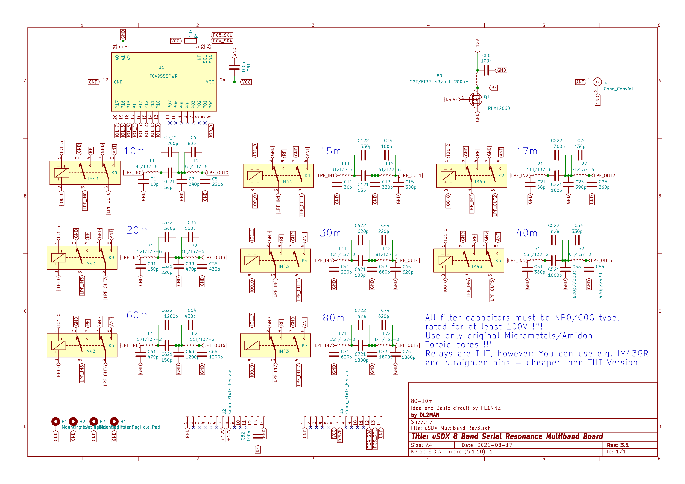
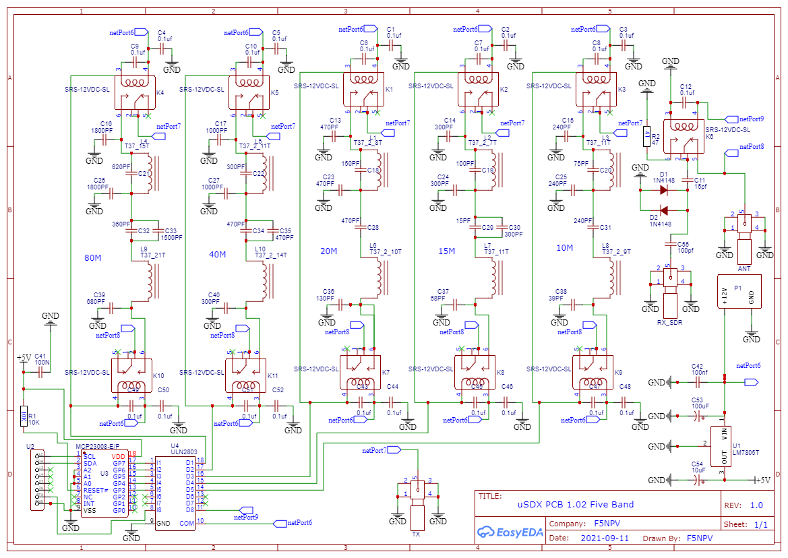
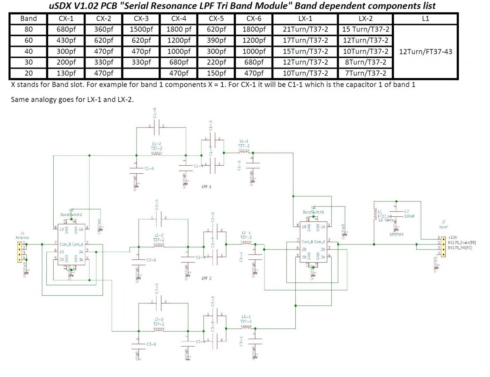
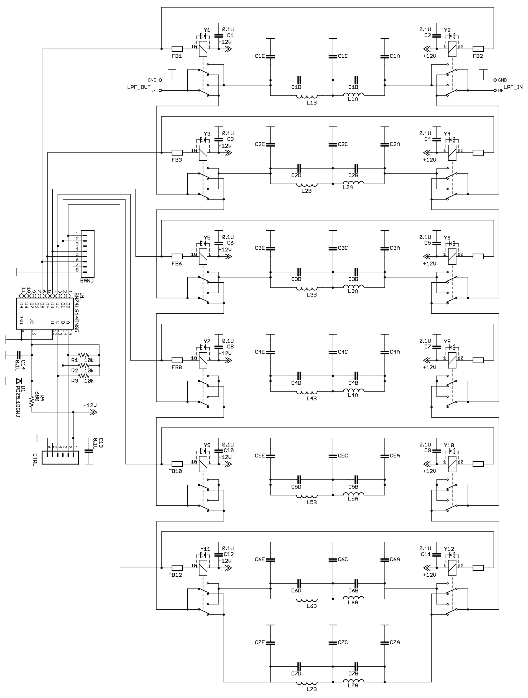
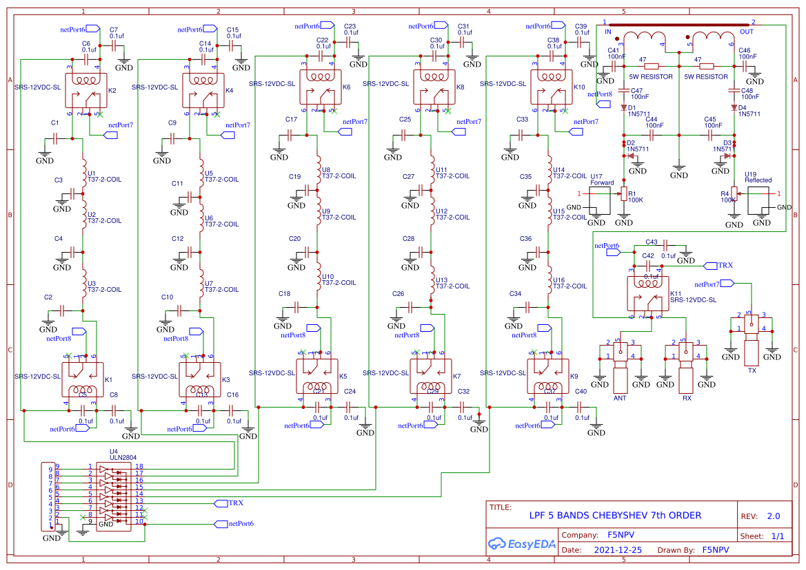
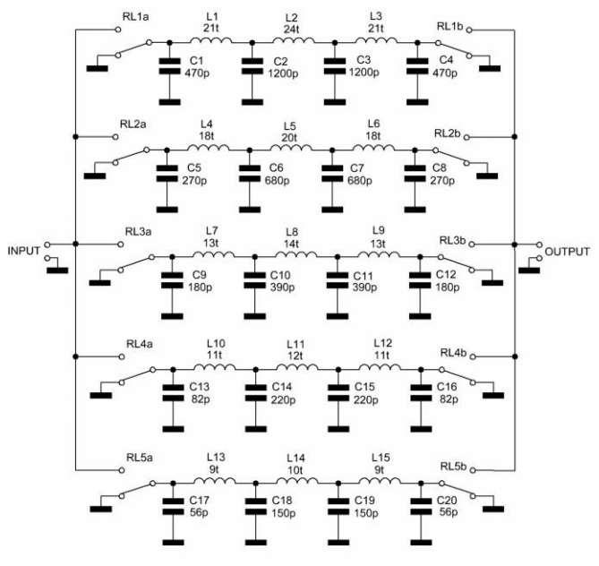

# Multi Band Low Pass Filters (LPFs) for Multi-band Radio Frequency (RF) Applications

## Fundamentals

### Purpose

A low pass filter on a radio ensures that a transceiver does not cause harmful interference to other radio users and for this reason is often a regulatory requirement. Additionally, it improves signal to noise ratio (SNR) and efficiency.

The designs discussed below all use __RLC (Resistor-Inductor-Capacitor) Low-Pass Filters__, the normal choice for amateur radio transceivers.

### Zoom-Out to Types of LPFs

Low-pass filters (LPFs) are not all based on resonance. While some low-pass filters do employ resonant circuits, there are various types of LPFs with different underlying principles:

 * __RC (Resistor-Capacitor) Low-Pass Filters__: These are the simplest form of LPFs and are not based on resonance. They use a resistor and a capacitor in series, with the output taken across the capacitor. The cutoff frequency is determined by the values of the resistor and capacitor. These are seen elsewhere in the circuitboard. Many practical filters in audio and simple electronic applications are of this type.
 * __RL (Resistor-Inductor) Low-Pass Filters__: These filters use a resistor and an inductor. The inductor blocks high-frequency signals while allowing low-frequency signals to pass. Like RC filters, RL filters are not inherently based on resonance. Many practical filters in audio and simple electronic applications are of this type.
 * __RLC (Resistor-Inductor-Capacitor) Low-Pass Filters__: These can be based on resonance, depending on the configuration. In an RLC circuit, the inductor and capacitor can form a resonant circuit at a particular frequency, and this resonance can be used to shape the filter's response. Resonance-based filters, such as those using RLC circuits, can provide sharp cutoff characteristics and are often used when specific frequency response characteristics are needed. This is the type of LPF generally used in amateur radio transceivers and in all of the designs discussed below.
 * __Active Low-Pass Filters__: These use operational amplifiers (op-amps) along with resistors and capacitors to achieve the desired filtering. They can provide amplification and more precise control over the filter characteristics. These filters are not necessarily based on resonance. Their drawback is that they are more complex, troublesome and expensive to implement.
 * __Digital Low-Pass Filters__: Implemented using digital signal processing (DSP) techniques, these filters apply mathematical algorithms to the input signal to remove high-frequency components. They are not based on resonance. They are the most complex and expensive of all filters, relying upon high speed analog to digital and gital to analog conversion.

## Resonance in RLC filters

RLC Low Pass Filters are based upon resonance, which is broken down in to two types:
 * Serial Resonance: Involves an inductor and a capacitor in series, leading to resonance at a specific frequency.
 * Parallel Resonance: Involves an inductor and a capacitor in parallel, leading to resonance at a specific frequency.

## General considerations

If RF power is accidentally directed toward the wrong place it can destroy components, so it is useful to ensure the design has some safety built in around power generation and switching. For example, "do not send RF power to antenna if antenna is not plugged in" would be a great design feature.

Secondly, manual interfaces (such as plugs and buttons) are probably not as useful as MCU-controlled interfaces for the following reasons: 

 * More chance of human error
 * More chance of accidental switching
 * More chance of software state not matching LPF or antenna state
 * In digital modes, an attached computer really needs to know what's going on

Thirdly, building out hardware for every band can be expensive, and not interesting to all users, therefore some option for selecting between what is available instead of mandating a total build would be a feature in some circumstances.

Finally, with respect to tuning, it is noted that there is a long standing tradition within the HAM radio community of manually winding coils. This provides the benefit that manual tuning is possible. The drawback is that there is manual work which is less repeatable. On the other hand, high power rated inductors are generally not produced to tight tolerances, with the majority claiming a 20% tolerance to their nominal value (always in the high power case this is a best-case figure), and a minority claiming a 10% tolerance (only in the low power case).

In terms of reliability/longevity, additional stresses will be placed upon components when adopting circuit topologies utilizing either parallel resonance or high frequencies, and with more components the chance of a failure at the system level increases substantially.

Therefore there are complex relationships in the design landscape creating tradeoffs between precision/high labour input/high component count/high component cost and simplicity.

## Review of observed filter topologies

### Ladder Network (Cauer Filter or Elliptic Filter)

This is seen in two of the uSDX designs:

 * [10m-80m uSDX 8 Band Serial Resonance Multiband Board](#design-1)
   * Classified as an 8-stage Ladder Network (Cauer Filter) with parallel resonance (elliptic filter variant)
 * [uSDX PCB 1.02 Five Band](#design-2)
   * Classified as a 5-stage Ladder Network (Cauer Filter) with parallel resonance (elliptic filter variant)

Core features of the design are as follows:

 * Serial and parallel resonance
 * Per frequency band component count: 6-7
   * Inductor count: 1-2
   * Capacitor count: 5-6
 * Good selectivity and effective filtering.

### Parallel resonance topology

This is seen in [the larger "RF Power Tools" black and white design](#design-3).

Core features of the design are as follows:

 * Improved selectivity (out-of-band rejection)
 * High efficiency due to effective parallel resonance
 * High stress on components due to parallel resonance means relative care must be taken at the design stage with component selection and at the operations stage with power limiting

### Chebyshev (7th order)

This is seen in two of the designs:

 * The ["LPF Bands Chebyshev 7th Order"](#design-5) design.
 * The [smaller black and white design](#design-7).

Core features of the design are as follows:

 * Per frequency band component count: 7
   * Inductor count: 3
   * Capacitor count: 4
 * High efficiency and sharp cutoff with minimal passband ripple.

### Chebyshev (4th order)

This is seen in the "LPF 4 bands" design.

Core features of the design are as follows:

 * Per frequency component count: 5
   * Inductor count: 2
   * Capacitor count: 3
 * Moderate efficiency
 * Reasonble roll-off characteristics
 * Lower risk of failure due to fewer components


## Reference Designs

### uSDX

<a name="design-1"></a>
First one is from the [uSDR Manual](http://fellegis.hu/radio/doksi/utmutato/uSDR_manual.html).



Second one is from [F5NP](https://f5npv.wordpress.com/wp-content/uploads/2021/09/schematic_usdx-pcb-1.02-5-band-lpf_2021-09-12.png).

<a name="design-2"></a>


Third one is from [Barb's website](https://antrak.org.tr/blog/usdx-multiband-low-pass-filter/).

<a name="design-4"></a>


### RF Power Tools

From [RF Power Tools LPF Website](https://sites.google.com/site/rfpowertools/rf-power-tools/low-pass-filters).

<a name="design-3"></a>


When fitted with the 7 band LPF, the amplifier can be used on all Amatuer bands from 1.8 to 54 MHz.

__Header Pinout__

 * Pin 1: 11-15VDC 13.8V Nominal, 100 mA max.
 * Pin 2: Band select Bit 0 (LSB) High = 2.4 - 5.0V; Low 0 - 0.5V; Pulled to 5V with a 10K
 * Pin 3: Band select Bit 1
 * Pin 4: Band select Bit 2 (MSB)
 * PIN 5: N/C
 * Pin 6: Ground

__Band Select__

```
BAND 	 Bit 2 	 Bit 1 	 Bit 0 	  Filter Position
  160M 	High  	 High 	 High 	 7
 80M 	 Low 	 Low 	 Low 	 6
 60M 	 Low 	 Low 	 High 	 5
  40M 	 Low 	 High 	 Low 	 4
  30M 	 Low 	 High 	 Low 	 4
  20M 	 Low 	  High 	  High 	 3
 17M 	 Low 	  High 	  High 	 3
  15M 	  High 	 Low 	  Low 	 2
  12M 	 High 	  Low 	  Low 	 2
  10M 	 High 	  Low 	  Low 	 2
  6M 	  High 	  Low 	  High 	 1
```

### F5NPV's 100W LPV

Described as 'LPF 100W [Chebyshev](https://en.wikipedia.org/wiki/Chebyshev_filter) 7th order', referring to the [mathematical basis of the filtering design](https://en.wikipedia.org/wiki/Chebyshev_polynomials).

[F5NPV seems an interesting fellow](https://f5npv.wordpress.com/) - he's French and lives in Brunei! Hope to QSL one day from here in Sydney.

Here's the [source OSHWLab page](https://oshwlab.com/F5NPV/ft8qrp-lpf_copy).

<a name="design-5"></a>


More background [here](https://f5npv.wordpress.com/irf530-mosfet-amplifier/) including this image.

<a name="design-7"></a>


Apparently based on the [earlier version with one less band and less filtering](https://oshwlab.com/F5NPV/ft8qrp-lpf).


## Component Selection

This area was quite difficult as it was unfamiliar. Notes are recorded to explain something of the selection process to others.

### Self-Resonant Frequency

__Self-Resonant Frequency (SRF)__ refers to the frequency at which the parasitic elements of a component (ie. capacitance for inductors, and inductance for capacitors) cause it to resonate, causing it to behaves differently.

 * of a capacitor is the frequency at which the inductive reactance of the capacitor's parasitic inductance equals its capacitive reactance, causing the capacitor to resonate and behave more like an inductor. 

 It is a crucial parameter to consider when designing low-pass filter (LPF) circuits, particularly in high-frequency applications. To maintain effective filtering, the SRF should be significantly higher than the highest frequency of interest in the filter. Poor capacitor selection with inappropriate SRF will create undesirable resonant effects and performance degradation through attenuation failure.

__Relationship between SRF and LPF Design__

 * __Effective Frequency Range__:
   * Below SRF a capacitor behaves primarily as a capacitor, providing the expected capacitive reactance which decreases with increasing frequency (XC=12πfCXC​=2πfC1​).
   * At SRF the capacitor's impedance is at a minimum, and it can exhibit both capacitive and inductive behavior.
   * Above SRF the capacitor behaves more like an inductor due to its parasitic inductance. This inductive behavior can adversely affect the filter's performance.

 * __Filter Performance__
   * __Passband and Stopband__: In an LPF, capacitors are used to shunt high-frequency signals to ground, effectively attenuating these frequencies. If the operating frequency approaches or exceeds the SRF, the capacitor's effectiveness diminishes, and it may not provide the desired attenuation.
   * __Component Selection__: To ensure the capacitor performs correctly within the filter's intended frequency range, its SRF should be well above the highest frequency of interest in the filter's stopband. This ensures that the capacitor maintains its capacitive properties throughout the operating range of the filter.
 * __Parasitic Inductance__
   * __Minimizing Inductance__: High-frequency LPF designs often require capacitors with low parasitic inductance to achieve a higher SRF. Surface-mount capacitors (SMD) and specialized high-frequency capacitors are typically used to minimize inductance and raise the SRF.
   * __Filter Design Implications__:
     * __Design Margin__: When designing an LPF, it's essential to choose capacitors with an SRF at least an order of magnitude higher than the cutoff frequency of the filter. This margin ensures that the capacitors perform effectively as capacitors throughout the filter's operational range.
     * __High-Frequency Considerations__: For very high-frequency applications, designers might use multiple capacitors in parallel (each with different SRFs) to extend the effective frequency range of the filter.
 * __Practical effect of component grades__
   * Low-Frequency LPF: In audio frequency applications (up to 20 kHz), standard capacitors with SRFs in the MHz range are suitable, as the operating frequencies are well below the SRF.
   * High-Frequency LPF: In RF applications (e.g. 100 MHz), capacitors with SRFs in the GHz range are required to ensure the capacitors behave as intended within the filter's operating range.

__Experimental determination of SRF__

It is not always possible to obtain SRF information from component datasheets, so it is worth learning a few methods to do so experimentally. In all methods, use short, low-inductance connections and proper grounding. For SMD components, orientation may be sigificant so try to replicate final circuit mounting conditions in the test configuration.

 1. __Using a network analyzer__
   * The most accurate tool for determining component SRF.
   * Method:
     * Fully calibrate the SRF with open, short and load standards.
     * Measure the impedance (S-parameters) over the expected SRF frequencies.
     * SRF is the minimum or bottom of the curve impedance point on both capacitors and inductors.

 2. __Using an Impedance Analyzer (LCR Meter) with Frequency Sweep__
   * Some LC meters an measure SRF directly, but others can be used if they have frequency sweep capabilities.
   * Method:
     * After a frequency sweep, identify the point of minimum impedance.

 3. __Using a signal generator and oscilloscope__
   * Fallback method if no other tools available.
   * Method:
     * Arrange the component with a resistor to form a simple resonant circuit.
       * For capacitors, place the resistor in series.
       * For inductors, place it in parallel.
     * Sweep the signal generator across the search range.
     * The frequency with minimum voltage on the oscilloscope is the SRF.

## Inductor DC Resistance (DCR)

Higher currents can cause significant heat generation in due to DC resistance (DCR).

Excessive heat can degrade the inductor's performance and potentially lead to failure.

One mitigation is using multiple components in parallel to achieve the required inductance.

The best mitigation is selecting components designed for RF use, which will generally have sub 1 ohm DCR.

## Capacitor Equivalent Series Resistance (ESR) and Equivalent Series Inductance (ESL)

At high currents and frequencies, capacitors with high ESR and ESL can exhibit poor performance:
 * High ESR increases power dissipation and heat.
 * High ESL affects the capacitor's effectiveness at RF frequencies.

Use capacitors specifically designed for RF applications with low ESR and ESL to maintain performance at high frequencies and currents.

## Voltage rating

Ensure all components are rated for peak volages present in the circuit.

Actual calculation is based on Q factor, which may be roughly described as "sensitivity" or "amplification". 

Note that while Q is a dynamic value that rises with frequency, Q factors are broadly distributed as follows:
 * Low Q (1 to 10): For circuits with significant resistive losses, such as those using standard resistors, inductors, and capacitors with higher equivalent series resistance (ESR). These are often found in low-frequency filters and general-purpose circuits.
 * Moderate Q (10 to 100): For circuits using higher-quality inductors and capacitors with lower ESR. These can be found in RF circuits, tuned amplifiers, and more precise filter designs.
 * High Q (100 to 1000 or more): For circuits with very low resistive losses, such as those using air-core inductors, high-Q ceramic capacitors, and inductor coils with minimal resistive loss. These are typical in high-frequency applications and precision filters. High Q is desirable in these cases.

Peak voltage is calculated as the nominal voltage multiplied by the Q factor, so for 12V x (Q=10) you would assume 120V peak voltage.

As an alternative to selecting components rated this highly (which can be impossible, bulky or expensive), it is possible to select a diode for TVS (transient voltage suppression) between the normal operating voltage and the component breakdown voltage.

## Notes on the overall design problem

After considering the practical concerns of component selection, the following points can be made:

 * It is __far easier to design filters correctly at lower frequencies / higher wavelengths__
 * As frequencies increase / wavelengths shorten there occur two major challenges:
   * __Self-resonant frequency__, or the frequency at which the capacitors and inductors misbehave, becomes insufficient on any larger-value component:
     * Three strategies for managing this challenge:
       * The selection of a plurality of tiny components placed in series
       * The selection of capacitor-only rather than capacitor-inductor type filter topologies, since inductors tend to reach this limit before capacitors do
       * The careful design of custom [distributed filters](https://en.wikipedia.org/wiki/Distributed-element_filter), which are built in to the PCB rather than deployed as discrete components. Wikipedia summarizes: "Distributed-element filters are mostly used at frequencies above the VHF (Very High Frequency) band (30 to 300 MHz). At these frequencies, the physical length of passive components is a significant fraction of the wavelength of the operating frequency, and it becomes difficult to use the conventional lumped element model. The exact point at which distributed-element modelling becomes necessary depends on the particular design under consideration." This is complex and time consuming.
   * __Power rating__, or the incapacity of components to safely deal with power levels present in the post power amplifier (PA) stage of the radio system
     * Two strategies:
       * Parallelism, or the selection of larger components and their placement in parallel in order to provide a higher effective power rating
         * This is not without its drawbacks, chiefly cost and space but also components that are not within a tight tolerance may introduce problematic behaviours in their interaction
     * I suspect that pre-amp rather than post-amp filters are preferred at these frequencies for this reason
